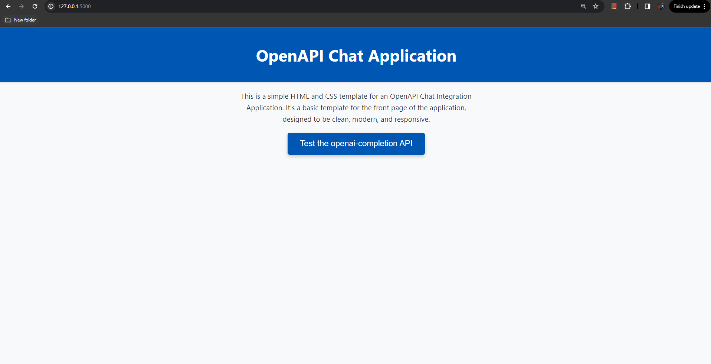
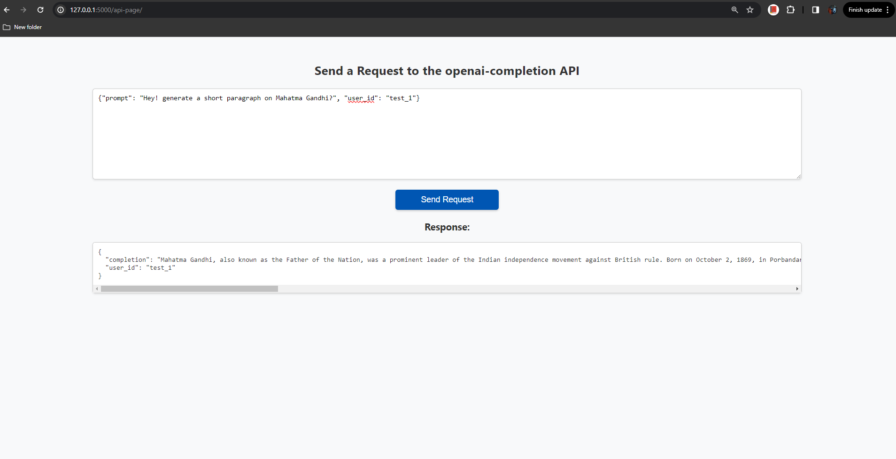
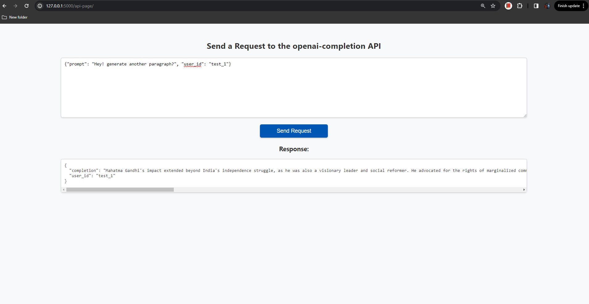

# Flask Application with OpenAI API Integration

This README outlines the objectives, setup steps, and usage of a Flask application designed to integrate with the OpenAI API. It covers everything from initial setup to how to interact with the API, along with versioning information and additional resources.

## Objectives

The primary goals of this Flask application are to:

- Develop a Flask API with an endpoint that interfaces with the OpenAI API.
- Securely handle OpenAI API credentials and manage API interactions.
- Log both the incoming requests and the API responses to a SQLite database.
- **[BONUS]** Implement edge case handling and rate limiting.
- **[BONUS]** Implement a unique ID system for user identification and chat continuity in a REST API-based chatbot.

## Version Requirements

Ensure your system meets the following version requirements:

- **Python**: 3.10.12
- **Flask**: 3.0.2
- **Flask-Limiter**: 3.5.1
- **Flask-SQLAlchemy**: 3.1.1
- **SQLite**: Integrated with Flask for logging and session management

## Setup and Installation

1. **Clone the Repository**: First, clone or download the git repository containing the source code. 

    ```bash
    # Clone the repository
    git clone <repository-url>
    ```

    [Follow this guide](https://docs.github.com/en/repositories/creating-and-managing-repositories/cloning-a-repository) for instructions on cloning a repository.

2. **Virtual Environment**: Create and activate a virtual environment using Python 3.10 or above for compatibility. 

    ```bash
    # Create a virtual environment
    python3 -m venv venv
    
    # Activate the virtual environment
    # On Windows
    venv\Scripts\activate
    # On Unix or MacOS
    source venv/bin/activate
    ```

    [Learn how to create a virtual environment here](https://docs.python.org/3/library/venv.html).

3. **Install Dependencies**: Navigate to the folder, inside the *main* branch, containing the cloned repository and install necessary packages using:

    ```bash
    pip install -r requirements.txt
    ```

4. **Environment Variables**: Create a `.flaskenv` file in the root directory to store Flask environment variables and secret keys, including your OpenAI API key. Add the following lines to your `.flaskenv` file:

    ```plaintext
    FLASK_APP=run.py
    FLASK_ENV=development
    OPENAI_API_KEY=<YOUR API KEY>
    ```

    Replace `<YOUR API KEY>` with your actual OpenAI API key.

5. **Run the Application**: Finally, start the Flask application with:

    ```bash
    flask run
    ```

    This command runs the app in debug mode as specified in the `run.py` file. The application will be accessible on port 5000, at `http://127.0.0.1:5000/`.

## Testing the API

To interact with the OpenAI completion API:

- Use the curl command for a quick test:

    ```bash
    curl -X POST http://localhost:5000/openai-completion/ -H "Content-Type: application/json" -d '{"prompt": "Hey! Generate a short paragraph on Mahatma Gandhi", "user_id": "test_1"}'
    ```

    Here, `prompt` is your message to GPT, and `user_id` is the unique identifier for continuing user chats.

- Alternatively, use the interactive application by clicking on the "**Test the openai-completion api**" button. Enter your prompt and user ID as directed. Refer to the images below for guidance on navigating the user interface.

## Images

Below are images that highlight the interactive application's interface for testing the OpenAI completion API. (Images are located in the `png/` folder of the main branch).

- 
- 
- 

## References

For further reading and resources:

- [Flask Documentation](https://flask.palletsprojects.com/en/3.0.x/)
- [OpenAI API Text Generation Guide](https://platform.openai.com/docs/guides/text-generation/chat-completions-api?lang=curl)
- [Generating Text with GPT and Python](https://accessibleai.dev/post/generating_text_with_gpt_and_python/)
- [Krish Naik's Flask & OpenAI API Tutorial](https://www.youtube.com/watch?v=CbpsDMwFG2g&ab_channel=KrishNaik)
- [OpenAI API Guide](https://platform.openai.com/docs/guides/text-generation)
